# Nodal Glass

**Slow, meditative music that draws itself.** Nodal Glass plays soft, overlapping tones and shows each one as the pattern it would make on a vibrating plate, like sand dancing on a metal sheet, lit up like stained glass. You can watch, play along, and record the result as a video ready for YouTube.

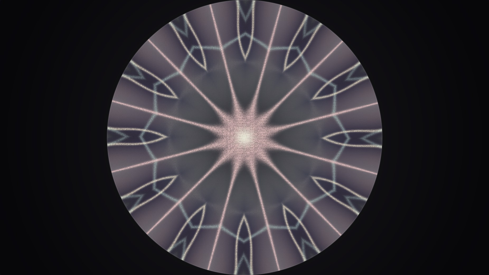

**[Open Nodal Glass in your browser](https://cryptix-security.github.io/fun-nodal-standing-wave/)**. Nothing to install, and it's free.

Nodal Glass is a just-for-fun side project from [Cryptix Security](https://github.com/Cryptix-Security). If you enjoy it, you can [support it on GitHub Sponsors](https://github.com/sponsors/Cryptix-Security). That's entirely optional.

## See it in action

[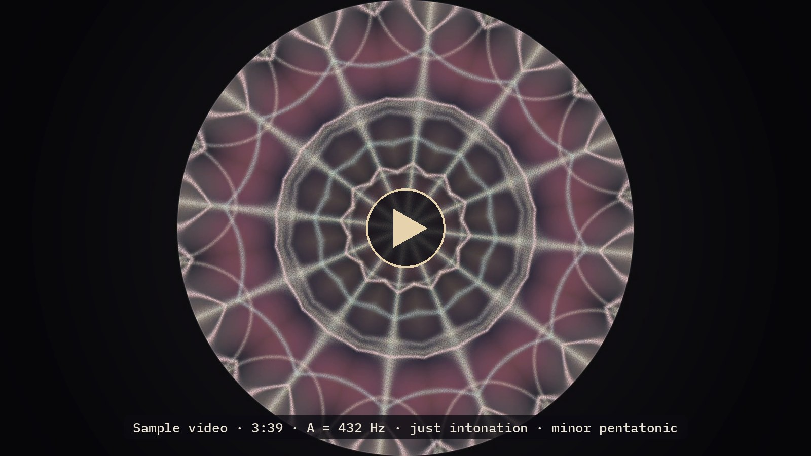](samples/nodal-glass-a432-just-minor-penta.mp4)

This sample runs for three and a half minutes and was made with Nodal Glass's own recorder. It uses a mandala plate, A = 432 Hz tuning, just intonation and the minor pentatonic scale. Click the picture to play it, with your sound on.

The repository holds a compressed copy of about 43 MB to keep downloads small. The app itself records at full quality.

---

## Contents

- [See it in action](#see-it-in-action)
- [Getting started](#getting-started)
- [A tour of the controls](#a-tour-of-the-controls)
- [Recording a video for YouTube](#recording-a-video-for-youtube)
- [Suggested settings](#suggested-settings)
- [The science: standing waves in plain words](#the-science-standing-waves-in-plain-words)
- [Privacy](#privacy)
- [License and support](#license-and-support)

---

## Getting started

### The easy way

1. Open **[cryptix-security.github.io/fun-nodal-standing-wave](https://cryptix-security.github.io/fun-nodal-standing-wave/)**.
2. Press **Start**, or tap the Space bar. Browsers only allow sound after you click something, which is why nothing plays until you do.
3. Turn your volume to a comfortable level and let it run.

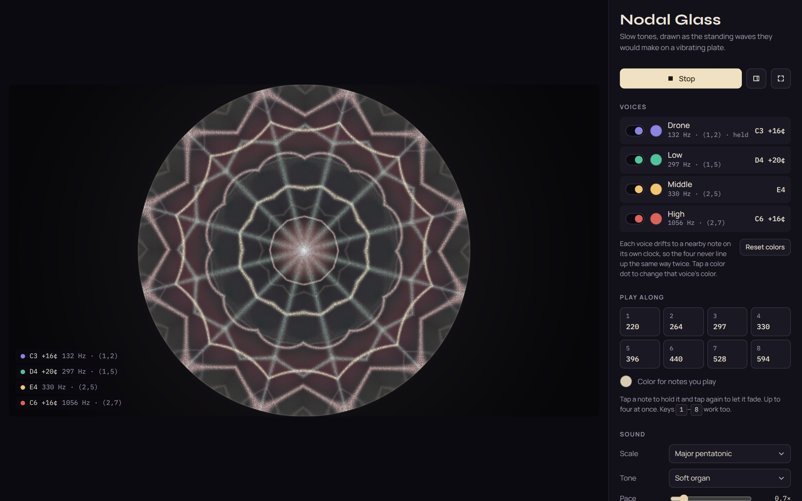

### Running it from your own computer

You can also keep a copy that works without the website.

1. [Download the ZIP file](https://github.com/Cryptix-Security/fun-nodal-standing-wave/archive/refs/heads/main.zip).
2. Unzip it.
3. Double-click **index.html**. It opens in your web browser.

It works offline. The only difference is that the lettering falls back to your computer's standard fonts.

### What you need

- A recent version of Chrome, Edge, Safari or Firefox, on a computer, tablet or phone.
- Speakers or headphones. Headphones bring out the low drone best.
- Nothing else. There's no account, sign-up or app store.

On phones the pattern sits on top and the controls scroll underneath.

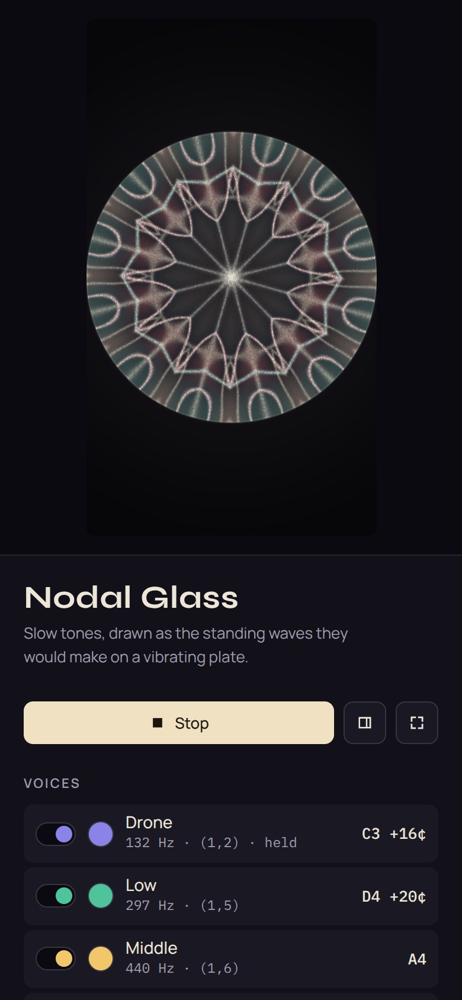

---

## A tour of the controls

The panel on the right holds every setting. Press **H** to hide it for a clean, full view of the pattern, and **F** for full screen. Your settings are remembered the next time you open the page in the same browser.

### Voices

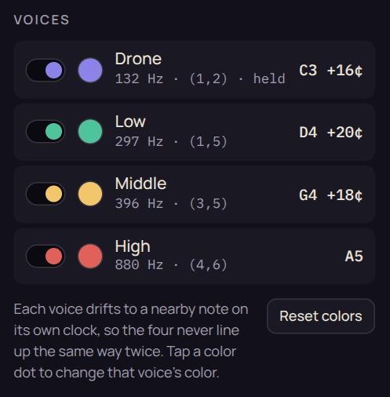

Four voices play at once, from the low **Drone** up to the **High** voice. Each one drifts to a nearby note on its own clock, every few seconds for the high voice and every twenty or so for the drone. Because the clocks never line up, the music and the pattern never repeat exactly.

- **Switch** turns a voice on or off.
- **Color dot** opens a color picker, so you can choose each voice's color. **Reset colors** brings back the originals.
- The small text shows the note's exact frequency in hertz (Hz, vibrations per second) and its pattern number, for example `(2,5)`.

 

### Play along

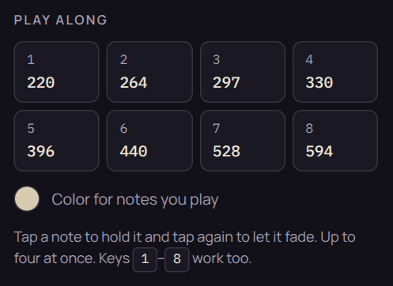

Eight notes you can add on top of the voices. Tap one to hold it and tap again to let it fade. You can hold up to four at once, or use the number keys **1** to **8**. Played notes have their own color, which you can also change.

 

### Sound

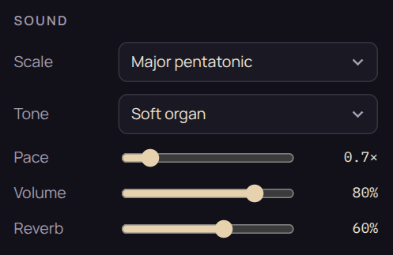

- **Scale** is the set of notes the voices choose from.
- **Tone** is the character of the sound: Soft organ, Pure sine, Hollow or Warm reed.
- **Pace** is how often notes change. Lower is slower and calmer.
- **Volume** sets the listening level. It also sets the level of any video you record.
- **Reverb** adds a sense of space, like a large quiet room.

 

| Scale | What it feels like |
|---|---|
| Major pentatonic | Open, bright and peaceful. No note ever clashes with another. |
| Minor pentatonic | Gentle and inward. Also clash-free. |
| Dorian | Thoughtful, with a little more movement. |
| Lydian | Dreamy and floating. |
| Hirajōshi | A Japanese scale, spare and slightly melancholy. |
| Plate resonances | Every note is played at the real relative pitch of its pattern. Otherworldly. See [the science](#from-strings-to-plates). |

### Tuning

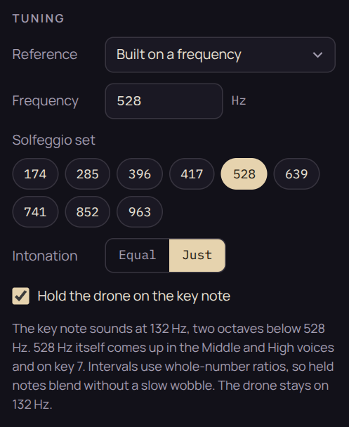

- **Reference** picks what the music is tuned to.
  - *Standard, A = 440 Hz* is the tuning almost all modern music uses.
  - *A = 432 Hz* is a popular alternative that sits slightly lower.
  - *Built on a frequency* builds the whole scale on any frequency you type in. Buttons for the commonly used Solfeggio set (174, 285, 396, 417, 528, 639, 741, 852 and 963 Hz) are one tap away. The hint underneath tells you where that exact frequency appears, for example "528 Hz itself comes up … on key 7."
- **Key** (standard tunings only) chooses the home note.
- **Intonation**
  - *Equal* is the tuning of a piano, where every step is the same size.
  - *Just* tunes every interval to a simple whole-number ratio. Long held notes then blend smoothly, without a slow wobble.
- **Hold the drone on the key note** keeps the lowest voice on the home note as a steady anchor while the others wander.

 

### Visuals

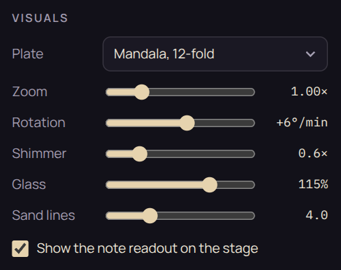

- **Plate** switches between a square plate and 6-, 8- or 12-fold mandalas.
- **Zoom** moves the pattern closer or farther.
- **Rotation** slowly turns the pattern, in degrees per minute. Set it to 0 to keep it still.
- **Shimmer** sets how fast the colored panes pulse.
- **Glass** sets how strongly the panes between the lines are colored.
- **Sand lines** sets how thick the bright lines are.
- **Show the note readout** shows or hides the list of notes in the corner. The readout never appears in recordings.

 

### Keyboard shortcuts

| Key | What it does |
|---|---|
| Space | Start or stop |
| 1 to 8 | Hold or release a play-along note |
| R | Start or stop recording |
| H | Hide or show the controls |
| F | Full screen |

---

## Recording a video for YouTube

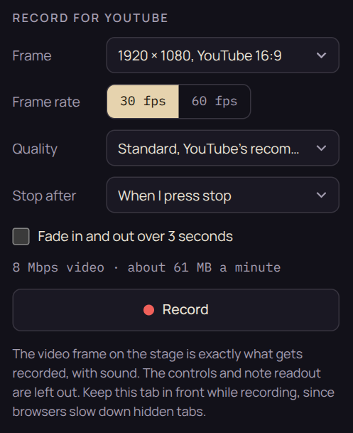

Nodal Glass can record the pattern and the sound together into a video file. The frame you see on screen is exactly what gets recorded. The controls, the note readout and your mouse pointer are left out.

1. **Frame** picks the video's shape and size.
   - 1920 × 1080 is standard YouTube HD.
   - 2560 × 1440 is sharper, with bigger files.
   - 1280 × 720 is lighter, for slower computers.
   - 1080 × 1920 is for YouTube Shorts.
   - 1080 × 1080 is square.
2. **Frame rate**: 30 fps is plenty for slow music, and 60 fps is extra smooth.
3. **Quality**: *Standard* uses YouTube's recommended upload bitrate. *High* makes larger files.
4. **Stop after** records for a set time, from 1 to 30 minutes, then stops by itself.
5. **Fade in and out** eases the picture and sound in at the start and out at the end.
6. Press **Record**, or **R**. The line above the button estimates the file size.
7. When it's done, a preview appears. Press **Save video** to download the file.

 

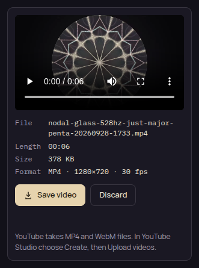

**File types.** Chrome, Edge and Safari usually save an MP4 file; Firefox saves WebM. YouTube accepts both. To upload, open [YouTube Studio](https://studio.youtube.com), choose **Create**, then **Upload videos**.

**Tips for a clean recording**

- **Keep the Nodal Glass tab in front.** Browsers slow down tabs you aren't looking at, which makes the video stutter.
- **Plug in a laptop** for long recordings, and close other heavy apps.
- **Long videos make big files.** Thirty minutes at 1080p is roughly 1.8 GB.
- **Name files by tuning.** File names include the tuning and scale, for example `nodal-glass-528hz-just-major-penta-20260928-1733.mp4`, so takes stay easy to tell apart.
- **Recording on phones** depends on the phone's browser. A computer gives the most reliable results.

---

## Suggested settings

Here are three starting points. Mix and match freely.

**Calm 528 Hz mandala**

- **Plate:** 12-fold mandala
- **Scale:** Major pentatonic
- **Tuning:** Built on a frequency, 528 Hz, Just intonation, Hold the drone on
- **Motion:** Pace 0.7×, Rotation +6°/min, Shimmer 0.6×
- **Tone:** Soft organ or Pure sine, Reverb about 60%

**Classic plate**

- **Plate:** Square plate
- **Scale:** Minor pentatonic
- **Tuning:** Standard
- **Everything else:** default settings. This is closest to the real sand-on-metal experiment.

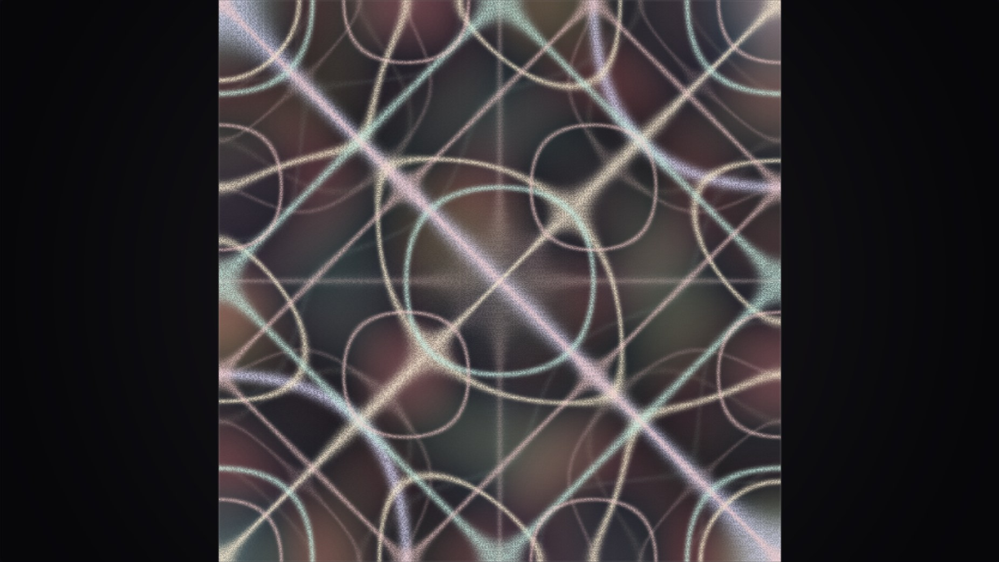

**Cool blues**

- **Plate:** 8-fold mandala
- **Colors:** set each voice to a shade of blue or violet
- **Visuals:** Glass about 130%, Sand lines about 3.5

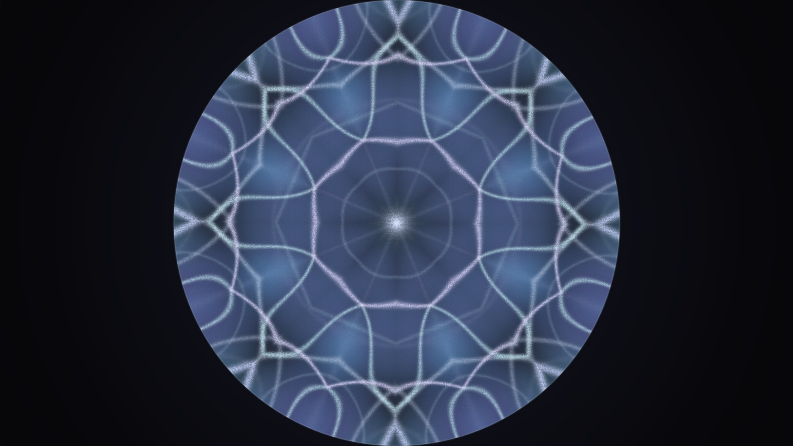

---

## The science: standing waves in plain words

### What is a standing wave?

Pluck a guitar string and it doesn't just wobble randomly. Waves race along it, bounce off both ends and overlap with themselves. At certain pitches the overlapping waves line up perfectly and settle into a steady shape that seems to stand still while it vibrates. That's a **standing wave**.

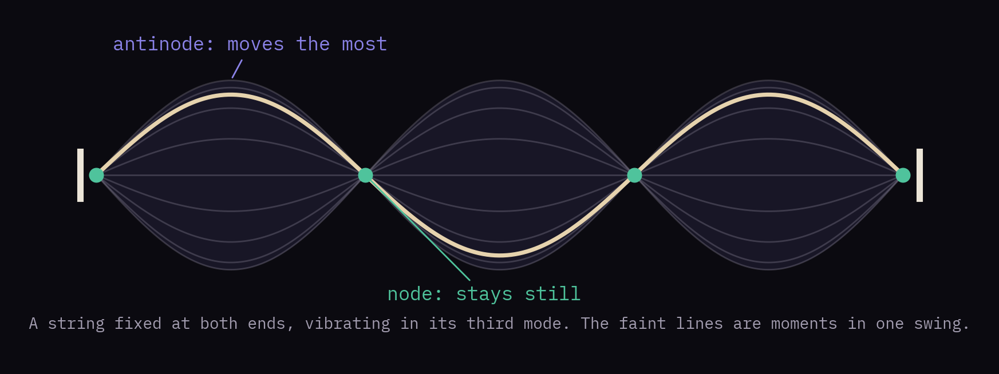

- **Nodes** are the points that never move.
- **Antinodes** are the points that swing the most.

A string can only do this at particular pitches. Those pitches are its natural notes, or **resonances**, and each one has its own shape.

### From strings to plates

In 1787 the German scientist **Ernst Chladni** sprinkled sand on a thin metal plate and made it ring with a violin bow. The sand bounced off the moving parts and gathered along the lines that stayed still: the plate's nodes. At each resonant pitch, a different pattern appeared. These are now called **Chladni figures**, and the study of visible sound patterns is often called **cymatics**.

Nodal Glass draws these patterns mathematically for an idealized square plate. Each pattern has a pair of numbers, like `(2,5)`, that describe how many times it ripples across and down. Low notes make simple patterns and high notes make busy ones, just like a real plate.

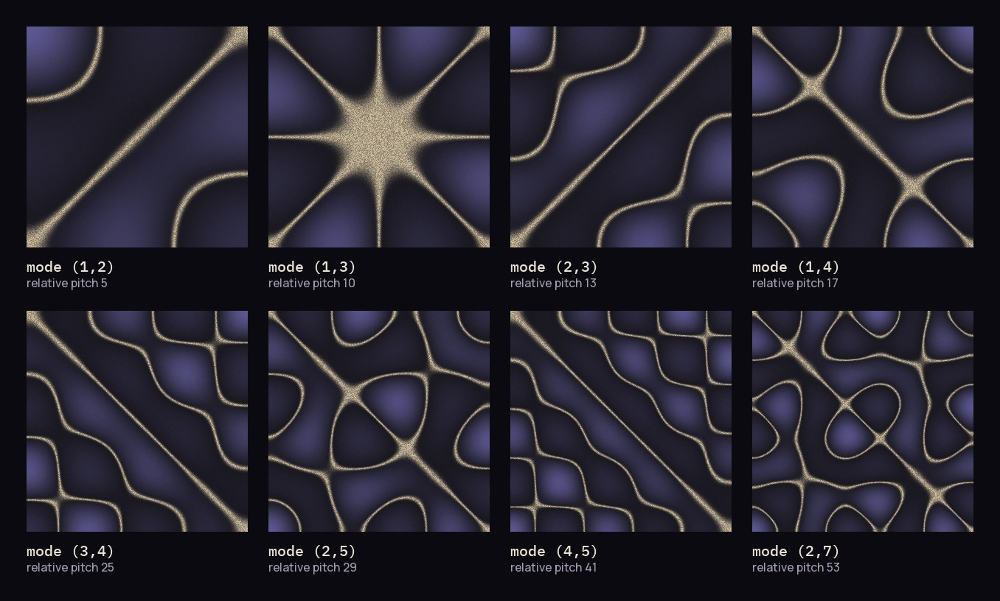

For this kind of plate, a pattern's pitch rises with the two numbers squared and added: m² + n². Pick the **Plate resonances** scale to hear each pattern at that true relative pitch.

### What the colors mean

- **The bright lines** are where sand would gather: the parts of the plate that stay still.
- **The colored panes** between them are the parts that move. Neighboring panes always move in opposite directions: one rises while the other falls.
- **The slow pulsing** is that back-and-forth. A real plate does it hundreds of times per second. Nodal Glass slows it down to a few seconds so you can see it.

### Why several notes at once is tricky

When two notes sound together on a real plate, the sand can only settle where *both* patterns are still at the same time. Usually that's just a few scattered points, so the beautiful lines break into dots. Nodal Glass lets each voice keep its own lines in its own color instead. The science is real, and this last step is the artistic part.

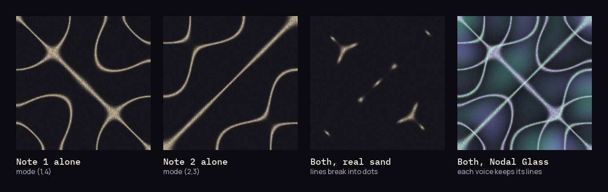

### About the mandalas

The mandala plates fold the square plate's pattern like a kaleidoscope, mirroring one slice around the circle. They're inspired by the round, symmetrical patterns that sound makes on the surface of water in a dish. The folding is an artistic choice rather than a simulation of a round plate.

### A note on "healing frequencies"

Many people find slow, steady tones deeply relaxing, and calm music and meditation can genuinely help with stress. Nodal Glass is made for relaxation, meditation, creativity and curiosity. It is not a medical device, and it doesn't claim that any frequency treats or cures anything.

---

## Privacy

- **Everything runs inside your browser.** Nothing you play, choose or record is uploaded anywhere.
- **Recordings** are saved straight to your own computer.
- **Settings** are remembered only in your own browser.
- **The only outside connection** is to Google Fonts, for the lettering.

---

## License and support

**Free to use, not open source.** You can use Nodal Glass for free, personally or commercially. The videos and recordings you make with it are yours to publish and monetize, including on YouTube. A credit line such as "Made with Nodal Glass by Cryptix Security" is appreciated but not required.

What the license doesn't allow, without permission:

- selling the app
- redistributing modified versions
- removing the credits

See [LICENSE](LICENSE) for the full terms.

**Supporting the project.** Nodal Glass is free and always will be. If it brings you some calm and you'd like to say thanks, you can [sponsor Cryptix Security on GitHub](https://github.com/sponsors/Cryptix-Security).

**Credits.** A just-for-fun side project from [Cryptix Security](https://github.com/Cryptix-Security). The lettering uses [Syne](https://fonts.google.com/specimen/Syne), [Manrope](https://fonts.google.com/specimen/Manrope) and [IBM Plex Mono](https://fonts.google.com/specimen/IBM+Plex+Mono), served by Google Fonts under the SIL Open Font License.
